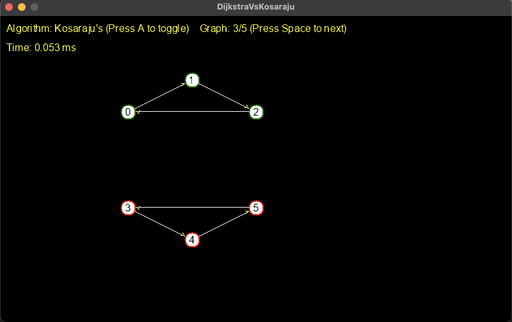
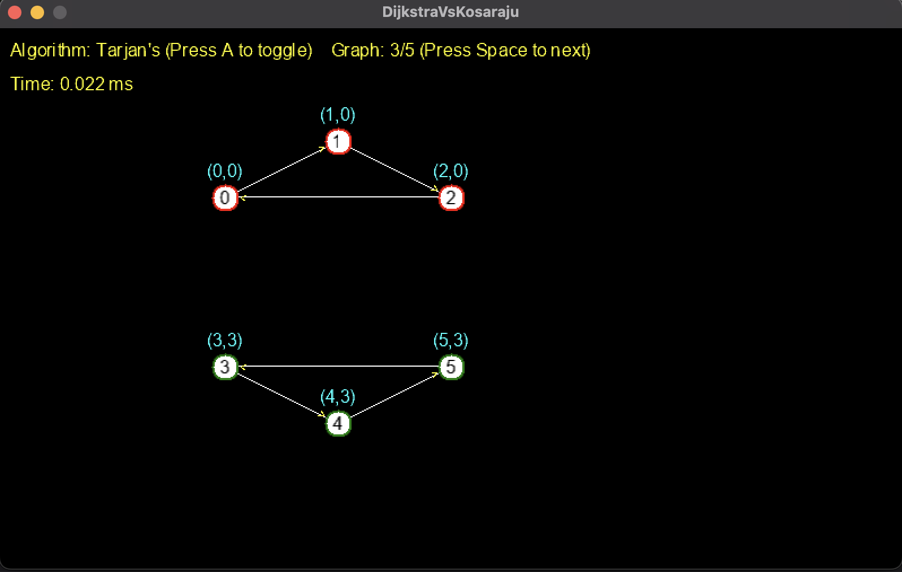
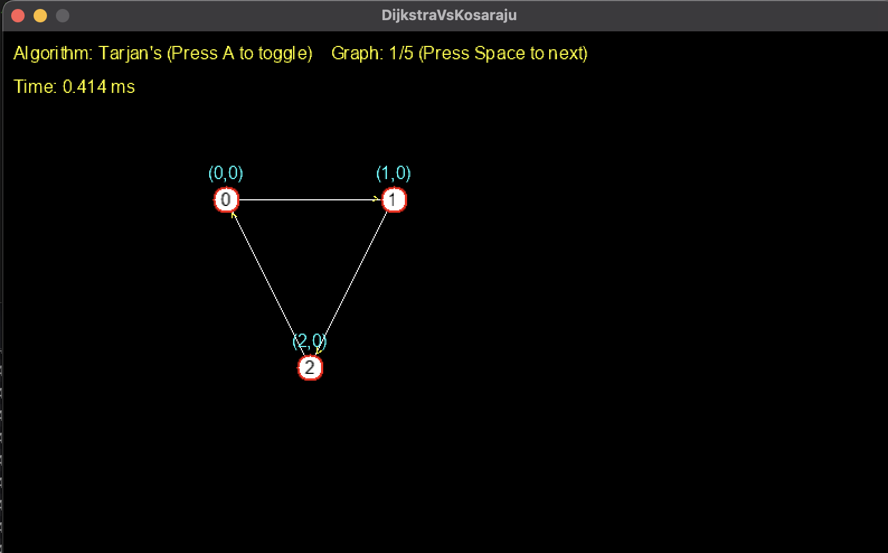

# Kosaraju's Vs Tarjan's Monogame SCC Visualizer

This is an interactive _Monogame_ Application demonstrating and comparing _tarjans_ and _Kosaraju's_ algorithms for finding Strongly Connected Components in a directed Graph

**Warning:** I named it DijktraVskosaraju and the namespace glitches out everytime I try to change it not sure as to why, but please do not change it as the namespaces will be different.

## Overview:

- Visualizes node-by-node traversal of each algorithm
- Highlights SCC's with an outline color
- Displays execution time in ms
- Supports algorithm toggle and multiple test graphs

## Prerequisites for Source Build:

- .Net 7.0 SDK or Runtime (Download from https://dotnet.microsoft.com/download)
- Monogame Framework

## Running from Source

1. **Clone the repository**

```
git clone <repourl>
```

2. **Restore dependencies in the directory**

```
dotnet restore
```

3. **Build and Run**

```
dotnet build
dotnet run
```

4. **Controls**

- A (Toggles between _Tarjans_ and _Kosaraju's_ algorithms)
- Space (Cycles through the predefined graphs)
- esc (Exit the program or ctrl+c in a terminal)

## Running the published Build

1.  **Navigate to the publish output folder:**
    `DijkstraVsKosaraju/bin/Release/net8.0/your_operating_system/publish` folder in which your executable resides.

2.  **Launch the executable**
    - Windows: Double click the .exe
    - macOS/Linux: Download the macOS version and run ./filename

Note:
Ensure the `Content/` folder (with your `.xnb` assets) is present alongside the executable. This is crucial for text loading.

# Pictures:






